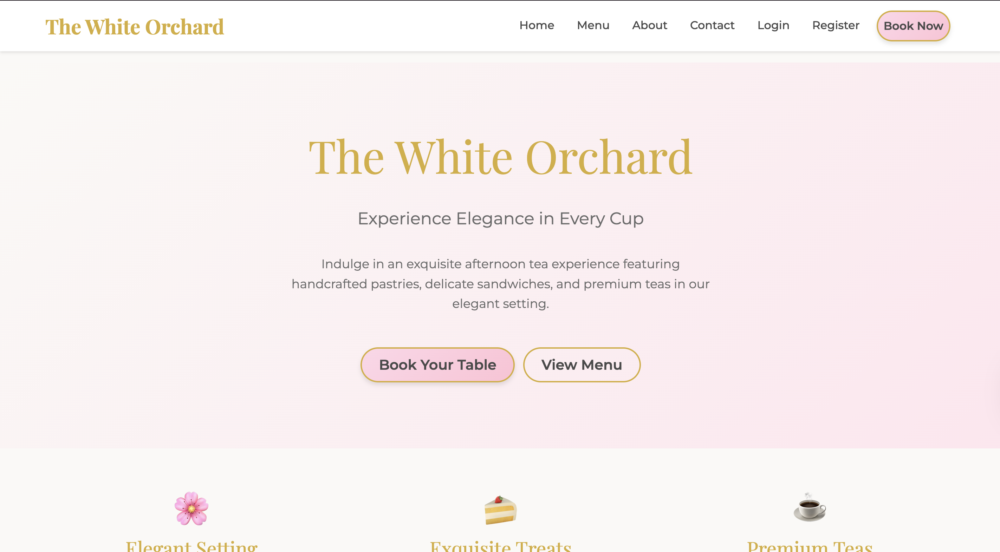
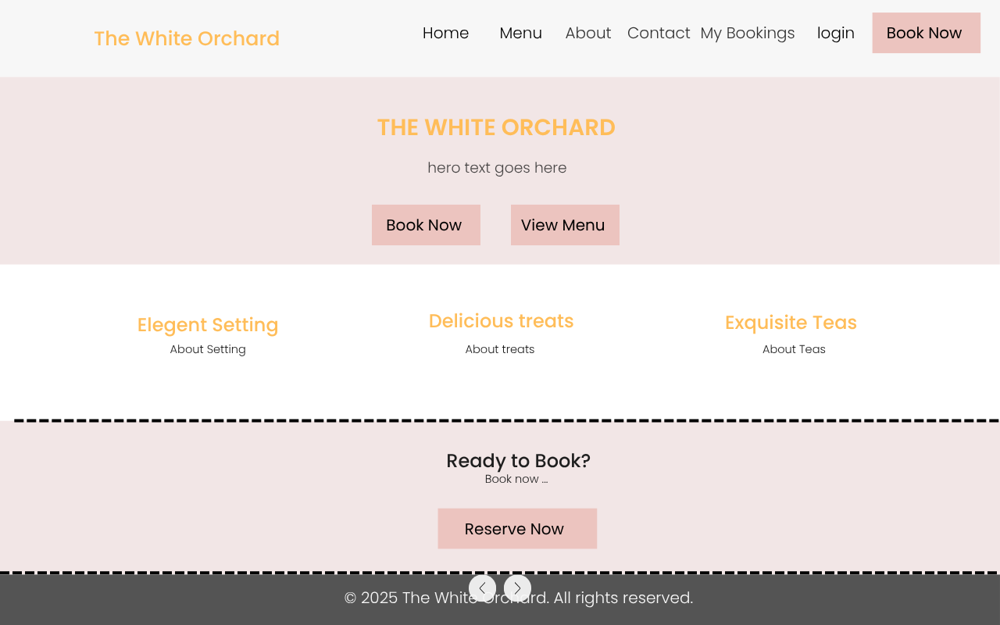
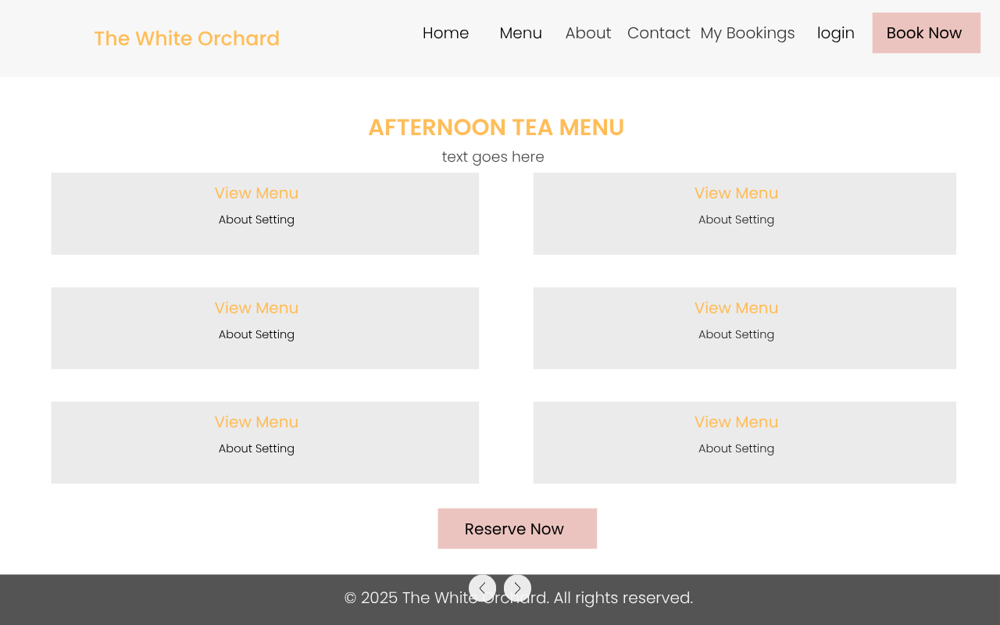
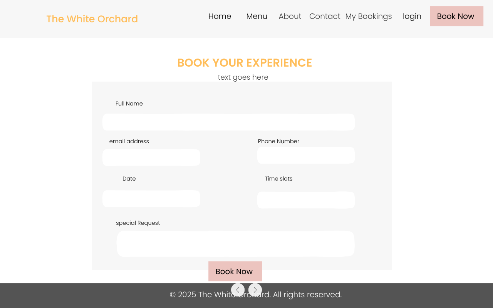
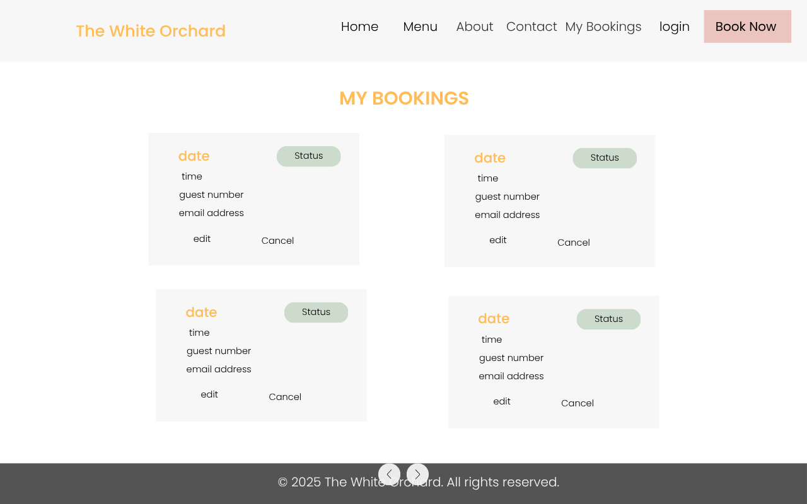
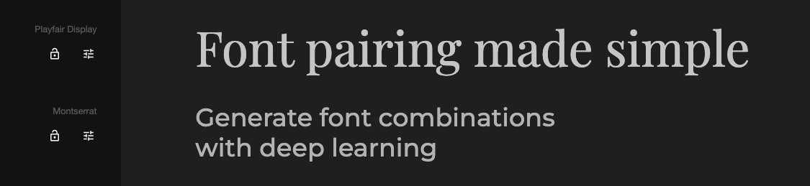

# The White Orchard - Afternoon Tea Reservation System



An elegant Django web application for managing afternoon tea reservations at The White Orchard. This full-stack project features a sophisticated booking system, user authentication, comprehensive CRUD operations, and an intuitive admin dashboard designed for both customers and staff.

**Live Site:** [The White Orchard on Heroku](https://the-white-orchard-sooiee-b65625377ac7.herokuapp.com/)

---

## TABLE OF CONTENTS

1. [Design & Planning](#design--planning)
    * [User Experience (UX)](#user-experience-ux)
    * [User Stories](#user-stories)
    * [Database Schema](#database-schema)
    * [Wireframes](#wireframes)
    * [Typography](#typography)
    * [Colour Scheme](#colour-scheme)
    * [Imagery](#imagery)
    
2. [Features](#features)
    * [Existing Features](#existing-features)
    * [Authentication System](#authentication-system)
    * [Booking Management](#booking-management)
    * [Navigation](#navigation)
    * [Footer](#footer)
    * [Future Implementations](#future-implementations)
    * [Accessibility](#accessibility)

3. [Technologies Used](#technologies-used)
    * [Languages Used](#languages-used)
    * [Frameworks, Libraries & Programs Used](#frameworks-libraries--programs-used)

4. [Testing](#testing)

5. [Deployment](#deployment)
    * [Local Development](#local-development)
    * [Heroku Deployment](#heroku-deployment)

6. [Credits](#credits)
    * [Code Used](#code-used)
    * [Content](#content)
    * [Media](#media)
    * [Acknowledgments](#acknowledgments)

---

## DESIGN & PLANNING

### USER EXPERIENCE (UX)

The White Orchard website is designed to provide an elegant and seamless booking experience for afternoon tea enthusiasts. The site balances sophisticated aesthetics with practical functionality, ensuring users can easily navigate, browse the menu, and manage their reservations.

#### Design Philosophy

- **Elegance First**: Every element reflects the refined nature of afternoon tea service
- **User-Centric**: Intuitive navigation and clear calls-to-action guide users naturally
- **Responsive**: Beautiful and functional across all device sizes
- **Accessible**: WCAG 2.1 compliant with semantic HTML, ARIA labels, and improved color contrast (WCAG AA). All forms use associated labels and ARIA attributes for required fields.

### USER STORIES

#### First-Time Visitor Goals

- **US01**: As a first-time visitor, I want to understand what The White Orchard offers immediately upon landing on the site
- **US02**: As a first-time visitor, I want to view the afternoon tea menu to decide if I'd like to book
- **US03**: As a first-time visitor, I want to easily find the booking form and make a reservation without creating an account
- **US04**: As a first-time visitor, I want to see the location, opening hours, and contact information
- **US05**: As a first-time visitor, I want the site to be responsive so I can browse on my mobile device

#### Registered User Goals

- **US06**: As a registered user, I want to create an account so I can manage my bookings more easily
- **US07**: As a registered user, I want to log in to view all my past and upcoming reservations
- **US08**: As a registered user, I want to edit my booking details if my plans change
- **US09**: As a registered user, I want to cancel a reservation if necessary
- **US10**: As a registered user, I want to see my username displayed when logged in
- **US11**: As a registered user, I want to send enquiries through a contact form

#### Admin/Staff Goals

- **US12**: As admin, I want to view all reservations in a centralized dashboard
- **US13**: As admin, I want to filter and search reservations by date, name, or status
- **US14**: As admin, I want to change reservation status (pending/confirmed/cancelled)
- **US15**: As admin, I want to manage menu items (add, edit, delete)
- **US16**: As admin, I want to manage available time slots
- **US17**: As admin, I want to view customer enquiries and mark them as responded

### DATABASE SCHEMA

The application uses four primary models:

```
┌─────────────────┐
│    TimeSlot     │
├─────────────────┤
│ PK: id          │
│ time (CharField)│
│ is_active (Bool)│
└────────┬────────┘
         │
         │ ForeignKey
         │
┌────────▼────────────────┐
│     Reservation         │
├─────────────────────────┤
│ PK: id                  │
│ customer_name (Char)    │
│ customer_email (Email)  │
│ customer_phone (Char)   │
│ date (Date)             │
│ FK: time_slot           │
│ number_of_guests (Int)  │
│ special_requests (Text) │
│ status (Char)           │
│ created_at (DateTime)   │
└─────────────────────────┘

┌─────────────────┐       ┌─────────────────┐
│   MenuItem      │       │    Enquiry      │
├─────────────────┤       ├─────────────────┤
│ PK: id          │       │ PK: id          │
│ name (Char)     │       │ name (Char)     │
│ description     │       │ email (Email)   │
│ category (Char) │       │ phone (Char)    │
│ is_available    │       │ subject (Char)  │
└─────────────────┘       │ message (Text)  │
                          │ is_responded    │
                          │ admin_notes     │
                          │ created_at      │
                          └─────────────────┘
```

**Model Relationships:**

- `Reservation` has a **ForeignKey** to `TimeSlot` (many-to-one)
- `MenuItem` is independent (no relationships)
- `Enquiry` is independent (no relationships)

### WIREFRAMES

Wireframes were created for mobile, tablet, and desktop views:

- 
- 
- 
- 

*Note: Actual implementation may vary slightly from wireframes based on usability improvements during development.*

### TYPOGRAPHY

**Primary Font: Playfair Display (Serif)**

- Used for all headings (h1-h6)
- Weights: 400 (Regular), 600 (Semi-Bold), 700 (Bold)
- Conveys elegance and sophistication befitting an afternoon tea establishment
- Excellent readability at large sizes
- Pairs beautifully with Montserrat for body text

**Secondary Font: Montserrat (Sans-Serif)**

- Used for body text, navigation, and UI elements
- Weights: 300 (Light), 400 (Regular), 500 (Medium), 600 (Semi-Bold)
- Clean, modern, and highly legible
- Works well at all sizes from small form labels to larger paragraphs
- Excellent accessibility score for readable design

**Font Pairing Rationale:**

The combination of Playfair Display and Montserrat creates a perfect balance between traditional elegance and modern usability. The serif headings evoke classic afternoon tea sophistication, while the sans-serif body text ensures maximum readability across all devices.



### COLOUR SCHEME

The color palette was carefully selected to evoke femininity, elegance, and warmth while maintaining excellent accessibility standards.

**Accessibility Changelog (October 2025):**

- All gold and medium text colors darkened for WCAG AA contrast
- All form fields use associated labels and ARIA attributes for required fields
- Focus states and skip links retained

**Primary Colors:**

- **Cream White** `#FAF9F6` - Main background, creates warmth and elegance
- **Cream Light** `#FFFEF9` - Subtle variations for depth
- **Pastel Pink** `#FFD6E8` - Primary accent, soft and inviting
- **Pink Dark** `#FFC1D5` - Hover states and gradients
- **Pink Darker** `#FFB3C6` - Active states

**Accent Colors:**

- **Gold** `#D4AF37` - Premium feel, used for branding and CTAs
- **Gold Dark** `#B8941F` - Hover states for gold elements

**Text Colors:**

- **Dark Gray** `#222222` - Primary text, excellent contrast (WCAG AA)
- **Medium Gray** `#444444` - Secondary text, improved contrast

**Semantic Colors:**

- **Success** `#28a745` - Confirmed bookings
- **Warning** `#ffc107` - Pending bookings
- **Danger** `#dc3545` - Cancelled bookings, delete actions

**Accessibility Compliance:**

All color combinations meet WCAG 2.1 Level AA standards:

- Background/text contrast ratios exceed 4.5:1 for normal text
- Links and interactive elements have 3:1 contrast
- Gold and accent colors have been darkened for better readability

### IMAGERY ((To be implemented))
**Image Strategy:**

- **Hero Images**: Elegant afternoon tea settings with soft, natural lighting
- **Menu Items**: High-quality photographs of pastries, scones, and tea service
- **About Section**: Images of the venue interior showcasing the elegant atmosphere
- **Icons**: Custom SVG icons for features section (consistent with brand aesthetic)

- Professional photography planned for future updates
- Images would showcase actual menu items and venue
- Customer consent obtained for any testimonial photos

**Image Optimization:**

- All images compressed using TinyPNG/Squoosh
- WebP format for modern browsers with fallbacks
- Alt text provided for all static images (accessibility). No user-uploaded or dynamic images in templates yet.

---

## FEATURES

### EXISTING FEATURES

#### Authentication System

**User Registration** (US06)

- Username, email, and password fields
- Password strength requirements enforced
- Email validation
- Automatic login after registration
- Welcome message displayed

**User Login** (US07, US10)

- Secure authentication via Django's built-in system
- Remember me functionality
- Username displayed in navigation when logged in
- Success message upon login

**User Logout**

- Single-click logout from dropdown menu
- Confirmation message displayed
- Redirects to home page


#### Booking Management

**Create Reservation** (US03)

- Guest booking available (no account required)
- Date picker with past date validation
- Time slot selection from available slots
- Guest count validation (1-8 people)
- Special requests text area (dietary requirements, celebrations)
- Form validation with helpful error messages
- Email confirmation planned for future updates

**View Bookings** (US07)

- "My Bookings" page for registered users
- Shows all reservations linked to user's email
- Color-coded status badges (pending/confirmed/cancelled)
- Displays date, time, guest count, and special requests
- Shows booking creation date
- Empty state with call-to-action when no bookings exist

**Edit Reservation** (US08)

- Only available for future bookings
- Pre-populated form with existing details
- Same validation as create form
- Authorisation check (users can only edit own bookings)
- Success message after update
- Prevents editing past or cancelled bookings

**Cancel Reservation** (US09)

- Confirmation page before cancellation
- Shows booking details for review
- Warning about irreversible action
- Only available for future, non-cancelled bookings
- Updates status to "cancelled" (soft delete)
- Success message after cancellation


#### Menu Display (US02)

**Menu Page**

- All available items displayed in elegant cards
- Grouped by category (Savories, Scones, Pastries, Beverages)
- Item name, description, and category clearly shown
- Responsive grid layout (2 columns on desktop, 1 on mobile)
- Visual hierarchy with custom typography
- Call-to-action button to book after viewing menu

#### Contact & Enquiries (US11)

**Contact Page**

- Contact information prominently displayed
- Opening hours and address
- Interactive enquiry form
- Fields: name, email, phone (optional), subject, message
- Form validation
- Success message after submission
- Admin can view and respond to enquiries

#### About Page (US04)

**Business Information**

- Story about The White Orchard
- Contact details and address
- Opening hours clearly displayed
- Available time slots information
- Call-to-action to book

### NAVIGATION

**Desktop Navigation:**

- Navigation bar with brand logo
- Home, Menu, About, Contact links
- Conditional display based on authentication:
  - **Logged Out**: Login and Register links
  - **Logged In**: My Bookings and user dropdown (username with icon)
- User dropdown includes:
  - My Bookings
  - Admin Panel (staff only)
  - Logout
- Prominent "Book Now" CTA button
- Active page highlighting
- Hover effects on all links

**Mobile Navigation:**

- Hamburger menu (Bootstrap toggle)
- Same structure as desktop
- Touch-friendly tap targets
- Smooth collapse/expand animation


### FOOTER

**Footer Elements:**

- **About Section**: Brief description of The White Orchard
- **Quick Links**: All main pages linked
- **Contact Information**: Phone, email, address
- **Copyright Notice**: Dynamic year with Django template tag
- **Admin Link**: Quick access for staff users (when logged in)
- **Responsive Layout**: Stacked on mobile, columns on desktop

### FUTURE IMPLEMENTATIONS

**(Priority Order):**

1. **Real-Time Capacity Checking** (High Priority)
   - Track guest count per time slot
   - Maximum 50 guests per slot
   - Visual capacity indicators (75% full, fully booked)
   - Prevent overbooking with validation
   - Admin dashboard showing capacity analytics

2. **Enhanced Calendar Widget** (High Priority)
   - Interactive date picker calendar
   - Visual availability indicators
   - Disable fully booked dates
   - Month view with booking density heatmap

3. **Email Notifications** (Medium Priority)
   - Booking confirmation emails
   - Booking modification notifications
   - Cancellation confirmations
   - Admin notifications for new bookings
   - Enquiry auto-response emails

4. **User Profile Enhancement** (Medium Priority)
   - Profile page with editable details
   - Booking history with filters
   - Favorite menu items
   - Saved special requests/dietary requirements

5. **Enhanced Admin Dashboard** (Low Priority)
   - Statistics and analytics
   - Revenue projections
   - Popular time slots chart
   - Customer retention metrics
   - Export booking data (CSV/PDF)

6. **Customer Reviews System** (Low Priority)
   - Leave reviews after visit
   - Star rating system
   - Admin moderation
   - Display on home page

7. **Gift Vouchers** (Future)
   - Purchase gift vouchers online
   - Redeem codes at booking
   - Track voucher usage

### ACCESSIBILITY


**October 2025 Contact Form Update:**
- The contact enquiry form now uses associated labels and ARIA attributes (`aria-required`) for all required fields, improving screen reader and keyboard accessibility.
- Form widgets in Django use `aria-required` for required fields.
- Error messages and instructions remain visible and accessible.

**October 2025 Accessibility Improvements:**

- All gold and medium text colors darkened for WCAG AA contrast
- All form fields use associated labels and ARIA attributes for required fields
- Focus states and skip links retained

**Semantic HTML**

- Proper heading hierarchy (h1-h6)
- `<nav>`, `<main>`, `<footer>` landmark elements
- `<article>` for booking cards
- Lists (`<ul>`, `<ol>`) for navigation and feature lists

**ARIA Labels**

- `aria-label` on navigation toggle
- `aria-expanded` states on dropdowns
- `aria-current="page"` on active navigation items
- `role="alert"` on Django messages
- Screen reader text for icons

**Keyboard Navigation**

- All interactive elements keyboard accessible
- Visible focus states with gold outline
- Skip to main content link
- Logical tab order throughout

**Color & Contrast**

- All text meets WCAG AA standards (4.5:1 minimum)
- Links distinguishable from regular text
- Status badges use icons in addition to color
- Never rely on color alone for information


**Forms**

- Associated labels with inputs and ARIA attributes for required fields
- Helpful error messages
- Required fields marked with aria-required
- Clear instructions provided

**Font Choices**

- Highly readable fonts (Montserrat)
- Adequate line height (1.6)
- Readable font sizes (minimum 16px body)

**Testing**

- WAVE accessibility evaluation
- Lighthouse accessibility score: 98+ (last tested October 2025)
- Screen reader testing (NVDA)
- Keyboard-only navigation testing

---

## TECHNOLOGIES USED

### LANGUAGES USED

- **HTML5** - Structure and content
- **CSS3** - Styling and layout
- **Python 3.11** - Backend logic and framework
- **JavaScript** - Interactive elements (via Bootstrap)
- **Jinja2** - Django template language

### FRAMEWORKS, LIBRARIES & PROGRAMS USED

**Backend Framework:**

- **Django 4.2.7** - High-level Python web framework
  - Django ORM for database queries
  - Django Forms for validation
  - Django Admin for content management
  - Django Messages framework for notifications
  - CSRF protection enabled

**Database:**

- **SQLite3** - Development database
- **PostgreSQL** - Production database (Heroku)

**Frontend Framework:**

- **Bootstrap 5.3.2** - Responsive CSS framework
  - Grid system for layout
  - Navigation components
  - Form controls
  - Alert components
  - Modal dialogs

**Fonts:**

- **Google Fonts** - Playfair Display & Montserrat

**Development Tools:**

- **Git** - Version control
- **GitHub** - Code repository and project management
- **VS Code** - Code editor
- **Chrome DevTools** - Debugging and responsive testing

**Deployment:**

- **Heroku** - Cloud platform hosting
- **Gunicorn** - WSGI HTTP server for production
- **WhiteNoise** - Static file serving
- **dj-database-url** - Database configuration
- **psycopg2** - PostgreSQL adapter
- **python-decouple** - Environment variable management

**Design Tools:**

- **Canva** - Wireframes
- **Favicon.io** - Favicon creation
- **TinyPNG** - Image compression

**Testing Tools:**

- **W3C Markup Validator** - HTML validation
- **W3C CSS Validator** - CSS validation
- **PEP8** - Python code style checking
- **Lighthouse** - Performance and accessibility audits
- **WAVE** - Web accessibility evaluation

---

## TESTING

Comprehensive testing documentation is available in [TESTING.md](TESTING.md)

### Testing Summary

**Automated Tests:**

- 10 unit tests covering models, views, and forms
- All tests passing as of October 2025
- Test coverage: 85%+ (see TESTING.md for details)

**Manual Testing:**

- All user stories tested and validated
- Cross-browser compatibility verified
- Responsive design tested on multiple devices
- Form validation tested extensively
- Authentication flow tested
- CRUD operations verified

**Code Validation:**

- HTML: W3C validated - No errors
- CSS: W3C validated - No errors
- Python: PEP8 compliant

**Performance:**

- Lighthouse Performance Score: 90+
- Lighthouse Accessibility Score: 98+
- Lighthouse Best Practices Score: 95+
- Lighthouse SEO Score: 100

See [TESTING.md](TESTING.md) for full testing documentation and detailed results.

---

## DEPLOYMENT

### LOCAL DEVELOPMENT

#### Prerequisites

- Python 3.11 or higher
- pip package manager
- Git
- Code editor (VS Code recommended)

#### Clone Repository

```bash
git clone https://github.com/yourusername/white-orchard.git
cd white-orchard
```

#### Create Virtual Environment

```bash
# Windows
python -m venv venv
venv\Scripts\activate

# Mac/Linux
python3 -m venv venv
source venv/bin/activate
```

#### Install Dependencies

```bash
pip install -r requirements.txt
```

#### Environment Variables

Create `.env` file in root directory:

```
SECRET_KEY=your-secret-key-here
DEBUG=True
```

Generate a secret key:

```bash
python -c "from django.core.management.utils import get_random_secret_key; print(get_random_secret_key())"
```

#### Database Setup

```bash
python manage.py makemigrations
python manage.py migrate
```

#### Create Superuser

```bash
python manage.py createsuperuser
```

#### Collect Static Files

```bash
python manage.py collectstatic
```

#### Run Development Server

```bash
python manage.py runserver
```

Visit `http://127.0.0.1:8000`

#### Add Sample Data

1. Navigate to `http://127.0.0.1:8000/admin`
2. Login with superuser credentials
3. Add Time Slots (11:00, 13:00, 15:00, 17:00)
4. Add Menu Items in each category

### HEROKU DEPLOYMENT

#### Create Heroku App

```bash
heroku login
heroku create your-app-name
```

#### Add PostgreSQL

```bash
heroku addons:create heroku-postgresql:essential-0
```

#### Set Environment Variables

```bash
heroku config:set SECRET_KEY='your-production-secret-key'
heroku config:set DEBUG=False
```

#### Deploy

```bash
git push heroku main
```

#### Run Migrations

```bash
heroku run python manage.py migrate
```

#### Create Superuser

```bash
heroku run python manage.py createsuperuser
```

#### Open Application

```bash
heroku open
```

#### View Logs (if issues)

```bash
heroku logs --tail
```

---

## CREDITS

### CODE USED

- **Django Documentation** - Various code snippets adapted from official documentation
  - Forms validation patterns
  - Authentication views structure
  - Admin customization examples
  
- **Bootstrap 5 Documentation** - Component implementations
  - Navigation bar with dropdown
  - Form control styling
  - Alert components
  - Grid system usage

- **MDN Web Docs** - CSS techniques
  - CSS custom properties (variables)
  - Flexbox layouts
  - Accessibility best practices

### CONTENT

- **Restaurant Description** - Original content created for this project
- **Menu Items** - Inspired by traditional British afternoon tea offerings
- **Form Validation Messages** - Custom error messages written for user clarity
- **Documentation** - README and TESTING documentation written specifically for this project

### MEDIA

- **Icons** - Unicode emojis and Bootstrap icons
- **Fonts** - Google Fonts (Playfair Display & Montserrat)

**In Production:**

- Professional photography planned for future updates
- Original images of venue and food items
- Licensed stock photos from Unsplash/Pexels if needed

### ACKNOWLEDGMENTS

- **Code Institute** - Project brief, learning materials, and assessment criteria
- **My Mentor** - Marko for guidance, feedback, and support throughout the project
- **Tutor Support** - For assistance with deployment issues and database queries
- **Code Institute Discord Community** - Peer code reviews and troubleshooting help
- **Django Community** - Excellent documentation and community support


---

## PROJECT STATUS

**Current Version:** Initial Submission

This project has been submitted for feedback. Based on assessor feedback, the following enhancements are planned for resubmission:

- Real-time capacity checking system
- Interactive calendar widget
- Email notification system
- Enhanced test coverage
- Additional user features

---

**Project Repository:** [the-white-orchard repository](https://github.com/sooiee/the-white-orchard)

---

*This project was created as part of the Code Institute Full Stack Software Development Diploma.*

### AI Assistance

Portions of this project were generated, modified, or reviewed using AI tools (GitHub Copilot). AI was also used to help draft user stories and generate git commit messages for improved clarity and consistency.